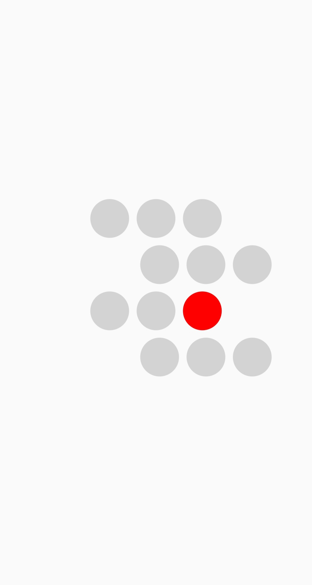

# Ubenwa Coding Exercise

Codes for BeyondDialog Exercise

>SCREEN SHOT

<table><tr>
  <td style="text-align: center">
  
</td>
  

 
</tr></table>

## Run
flutter packages get  
flutter run

## Download App

Click the [DOWNLOAD APP](https://github.com/saeedbello/beyond_dialog_exercise/raw/master/app-release.apk) to download the .apk version of the app.

